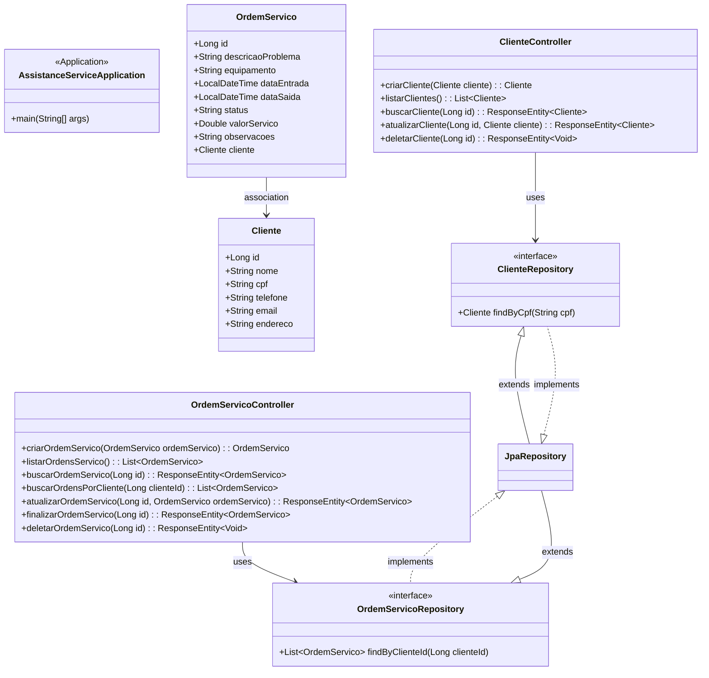

# Estrutura básica para a API REST de assistência técnica. 
Aqui está um resumo do que foi implementado:

## Estrutura do Projeto:

Configuração do Maven com as dependências necessárias.

Configuração do banco de dados H2.

Estrutura de pacotes organizada.

### Entidades:

Cliente (id, nome, cpf, telefone, email, endereco)

OrdemServico (id, cliente, descricaoProblema, equipamento, datas, status, valor, observacoes)

### Repositories:

ClienteRepository com busca por CPF

OrdemServicoRepository com busca por cliente

### Controllers:

ClienteController com CRUD completo

OrdemServicoController com CRUD e funcionalidades específicas

Endpoints principais:

POST /api/clientes - Criar cliente

GET /api/clientes - Listar clientes

GET /api/clientes/{id} - Buscar cliente específico

PUT /api/clientes/{id} - Atualizar cliente

DELETE /api/clientes/{id} - Deletar cliente

POST /api/ordens-servico - Criar ordem de serviço

GET /api/ordens-servico - Listar ordens

GET /api/ordens-servico/{id} - Buscar ordem específica

PUT /api/ordens-servico/{id} - Atualizar ordem

PUT /api/ordens-servico/{id}/finalizar - Finalizar ordem

GET /api/ordens-servico/cliente/{clienteId} - Buscar ordens por cliente

### Para executar o projeto:

Importe em sua IDE como projeto Maven

Execute a classe AssistanceServiceApplication

Acesse o Swagger UI em: http://localhost:8080/swagger-ui.html

Console do H2 em: http://localhost:8080/h2-console
